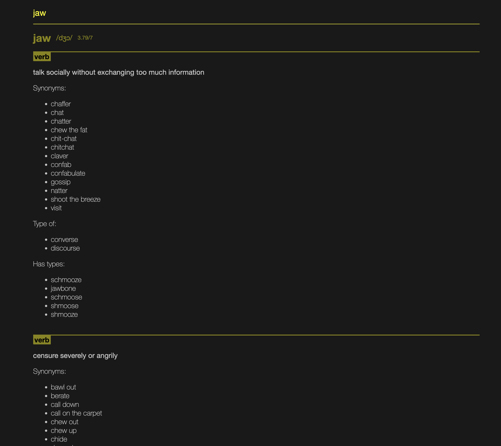
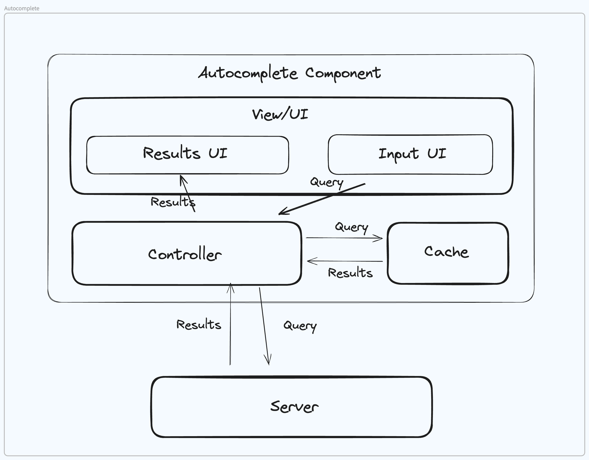

# Word Explorer

## How it Works
Simply input a word, and our web app leverages an API to retrieve its definition.

## App Preview

## Implementation Insights
Ever wondered about the inner workings? Check out our app's architecture below.

## Technologies Used
- [React.js](https://react.dev)
- [Typescript](https://www.typescriptlang.org/)
- [Bun](https://bun.sh) (Used as Typescript runner, Bundler and Node.js API)
- [Vite](https://vitejs.dev/) (Frontend server tool)
- [Immer](https://immerjs.github.io/immer/) (Immutable state management)

## Hosting
Served seamlessly with [Vercel](https://vercel.com/). Explore the world of words effortlessly!
